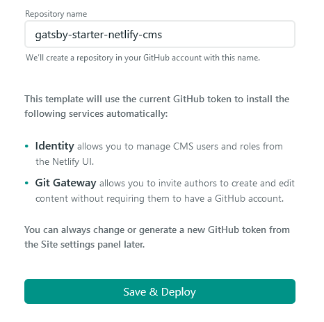
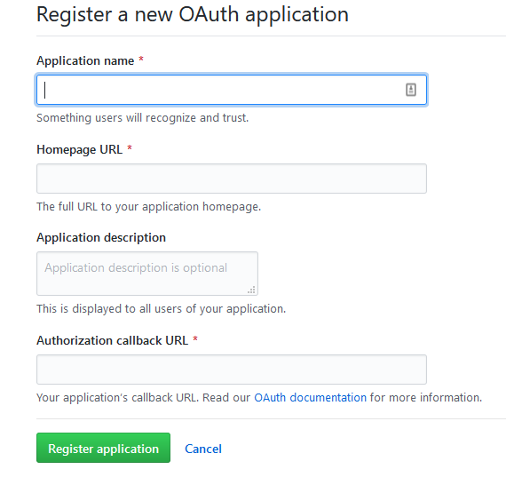

It's been a while since I've posted I've been working on a couple of posts, but am yet to finish them and I've enjoyed working with Gatsby and I figured I'd post about my thoughts on it so far.

As I've been meaning to experiment and learn a bit more about [Gatsby](https://gatsbyjs.org) for a while given the lockdown it seemed a good point to start (yet another) a project to mix things up a bit and learn something new/different. I've gone the tutorials on the docs which are very good and highly recommended for getting started.

## Why Gatsby?

Well my personal site which is very much a work in progress at moment and probably will be for a while - at least until I finish some side projects so I actually have some content to add it (apart from this blog of course) - is built with [Gridsome](https://gridsome.org/) which is the Vue SSG (Static Site Generator) alternative to Gatsby.

### Headless CMSs

**The choice is yours as there are many options out there for Headless CMSs to learn more about git or API-driven CMSs visit the [site](https://headlesscms.org/about) which is run by Netlify**

As I use [NetlifyCMS](https://www.netlifycms.org/) with my personal site and it can be used across pretty much any SSG including Gatsby, Jekyll and Hugo and others I decided to try and setup with my Gatsby project to see how easy it was and it turns out it was fairly straightforward. Firstly you have the option to set it up with a [template](https://www.netlifycms.org/docs/start-with-a-template/) you simply click to Deploy to Netlify button for which every starter you wish to use by default this will attempt to connect to Github but you can also use GitLab. You connect to whichever provider you use you are asked to select a repo name:



click and deploy and voila in a few minutes you'll have a new project setup ready to go on Github. I tried this method first but a lot of setup is beyond what I need and understand right now plus I wantred to do it myself and start from scratch.

So I chose the other option which is to add NetlifyCMS to an existing site. In the docs there are a section on using various Headless CMSs including netlify and Wordpress among others. I followed [the docs](https://www.gatsbyjs.org/docs/sourcing-from-netlify-cms/#processing-netlify-cms-output-with-gatsby) there are two npm modules you will need to install:
`npm install --save netlify-cms-app gatsby-plugin-netlify-cms`

you will need to add it to your `gatsby.config.js` file:

```javascript
module.exports = {
  plugins: [`gatsby-plugin-netlify-cms`],
}
```

You need to add an admin folder inside your static directory this is where the `config.yml` file goes. This is the examples file given in the docs:

```yaml
backend:
  name: test-repo

media_folder: static/assets
public_folder: /assets

collections:
  - name: blog
    label: Blog
    folder: blog
    create: true
    fields:
      - { name: path, label: Path }
      - { name: date, label: Date, widget: datetime }
      - { name: title, label: Title }
      - { name: body, label: Body, widget: markdown }
```

backend is where everything is hosted so in this case it will be:

```yaml
name: github
repo: git_username/name_of_repo
```

the folder name can be whatever you like assets, images etc for the collections you will need a different one for each type of page you wish to create in my case this will be for my blog so I will be using the above example.

You can test this locally by running `gatsby develop` sand the going to `http://localhost:8000/admin/` - note the trailing slash is required as this caught me out to start with.

##### Authentication

In order for your changes to be saved to your repo you will to authenticate with Github. To do this you will need to add your site as an OAuth application in your Github seutings under **Developer settings** > **OAuth**.



Add your details the important is the authorization callback URL this must be:

`https://api.netlify.com/auth/done`

Once saved you will be given an Client ID and Client Secret which need to be added to your Netlify site under **Settings** > **Access Control** > **OAuth**. It's fairly straightforward to setup and if you want more information you can check out the [Netlify docs](https://docs.netlify.com/visitor-access/oauth-provider-tokens/#setup-and-settings).

#### Building with Gatsby

When starting my project instead of using the default starter which a lot fo config setup for you I decided to go with hello-world-starter which is essentially a blank canvas for getting started without any config done for you.

Working my way through the docs so far I have created a homepage and components for the header, main navigation and footer as well as a simple base layout which I decided for now to save in a separate layouts folder with the possibility I may create some different layouts. For the CSS I debated using scss as I would like to learn more, but currently have gone down the [CSS modules](https://www.gatsbyjs.org/docs/css-modules/) route as the site grows this may change but for now it works well.

Some of my pages are js files but many of them for my site I am planning to write in markdown and in order for these files to be created as pages there are some plugins and setup required. I won't detail that here as the [Gatsby docs](https://www.gatsbyjs.org/tutorial/part-seven/) do a much better job than I would. All I know so far is that it works and does what I need it to do and that convert markdown into pages.

I have basic site up and running doing what I want now I just need to add some content... no doubt there will be challenges and many questions ahead but I'm looking forward to it.
